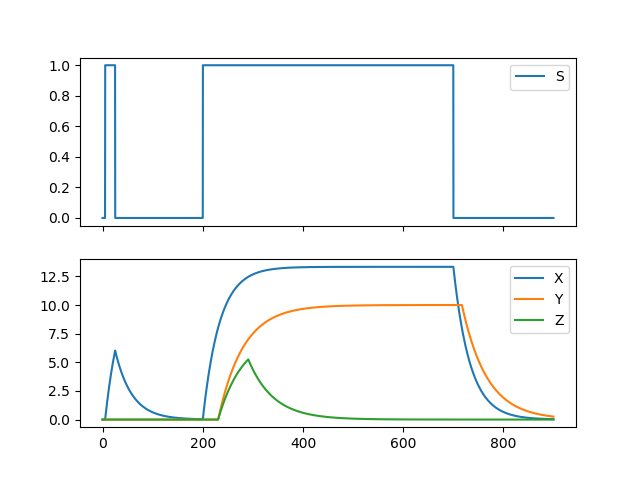
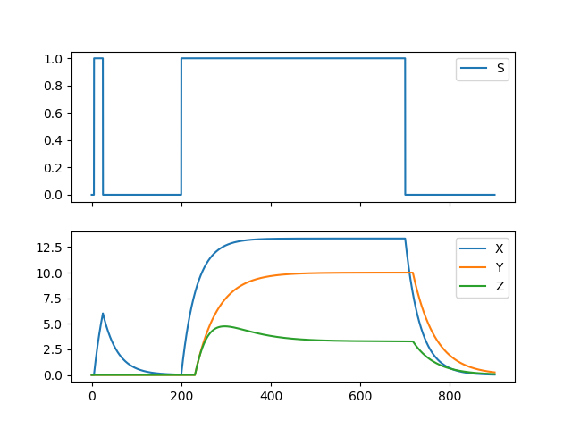

# Gene Regulatory Networks

The expression of useful gene products is central to the cell's survival. Equally important is that these gene products are produced at the right time under the right conditions. The cell can therefore be taken as a computation machine which takes a variety of environmental signals and produces an output of gene expression in response. These computations are carried out, in part, by gene regulatory networks. In these, one gene's product might activate or repress the expression of another gene. The interactions beteween components can exhibit complicated dynamics with behaviours such as memory, oscillations and noise filtering. The time evolution of a given gene regulatory network can be examined with this program.

This is done by setting up a system of differential equations from the user inputted gene network and then solving it numerically by Euler's method.

## Gene Expression Model

The concentration of a gene's product `X` continously falls at a rate proportional to `X`. This constant of proportionality, `alpha`, is the sum of the rates of protein degradation and cell growth. 

To balance the fall in concentration protein is continously produced. This is controlled by the abundance of activating or repressing proteins. Genes can have operators, which are binding sites for a single ligand protein. The occupancy of a given operator by a ligand influences the rate of expression according to whether it is a repressor or an activator. The percentage occupation by a ligand is given by the Michaelis function:

%20%3D%20%5Cfrac%20%7BX%5En%7D%7BK%5En%2BX%5En%7D)

Where `K` is the threshold at which there is 0.5 occupation, `n` is a measure of the cooperativity of binding and `omega` is the system's state. For simplicity, `n` can sometimes be taken to tend to infinity and so `g` becomes 1 if `X > K` and 0 otherwise. Because binding to operators is independent, the fractional occupancy of a combination of operator binding states, `i`, is just the product of the occupancies of the operators. For example, for the operator state X bound, Y bound, Z not bound. The fractional occupancy would be:

%20%3D%20%5Cfrac%20%7BX%5E%7Bn_1%7D%7D%7BK_1%5E%7Bn_1%7D%2BX%5E%7Bn_1%7D%7D%20%5Cfrac%20%7BY%5E%7Bn_2%7D%7D%7BK_2%5E%7Bn_2%7D%2BY%5E%7Bn_2%7D%7D%20(1-%5Cfrac%20%7BZ%5E%7Bn_3%7D%7D%7BK_3%5E%7Bn_3%7D%2BZ%5E%7Bn_3%7D%7D))

For every possible combination of operator binding states, there is an associated rate of production, `beta`. The rate of change of a gene's protein is therefore:

)

For example, for a simple gene with one operator to which Y can bind and act as a repressor, the differential equation becomes:

)

Here if Y is bound, `beta` is 0 so that term need not be taken into account. It can be seen that as `Y` increases, the rate of change of `X` decreases, in line with the expected behaviour.

## Examples

Here are some of the behaviours that gene regulatory networks can exhibit and how they are implemented. `config.py` files and gene network files are found in [GeneNetworks](https://github.com/JBQuim/Gene-Regulatory-Networks/tree/master/GeneNetworks).

#### Incoherent feedforward Loop

In this network, X activates Y and Z but Y represses Z. Both are taken to be highly cooperative and so their activity can be approximated as step functions. X only functions when there is a signal, S, present. The result is a prolonged signal in S is converted into a pulse of Z. This is because X initially activates Z expression but eventually Y represses it, converting it into a pulse. If the signal is short, X does not build up and there is no response in Z. 
 

If Y is not a strong a repressor as before, instead of a pulse, Z settles into a steady state concentration. Crucially the response time, time taken to reach half steady state, is shorter here than if X had directly activated Z.
 

#### Coherent Feedforward Loop

If instead Y is 
