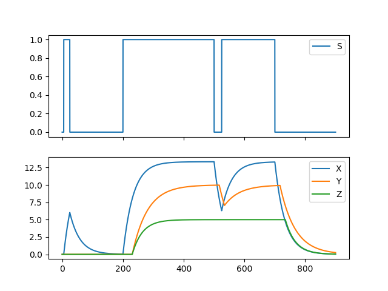
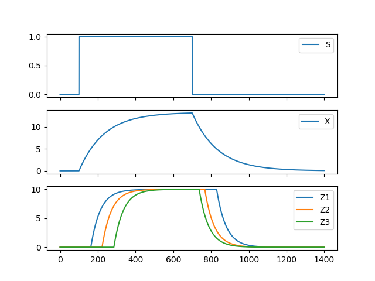
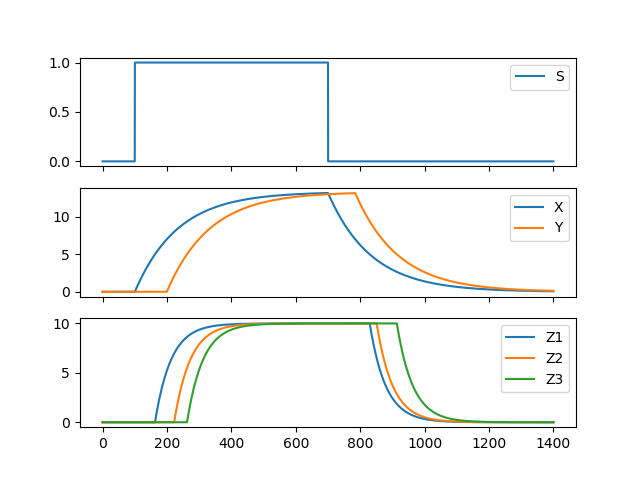
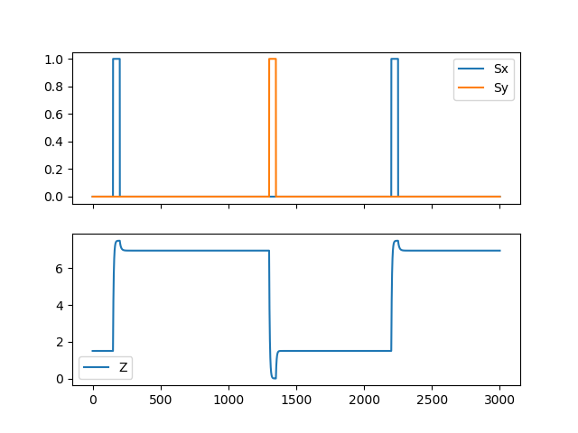
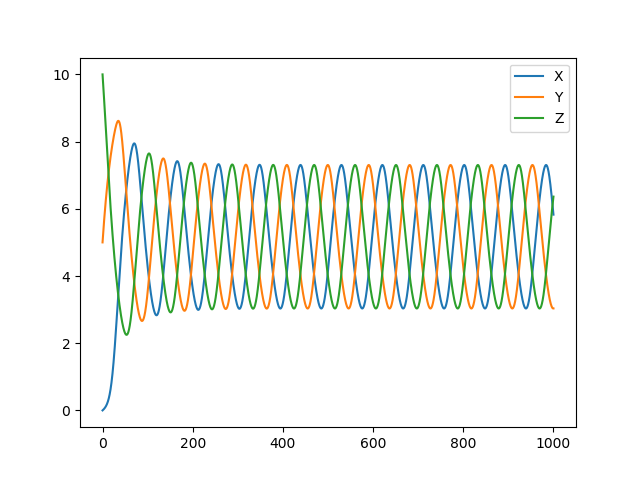
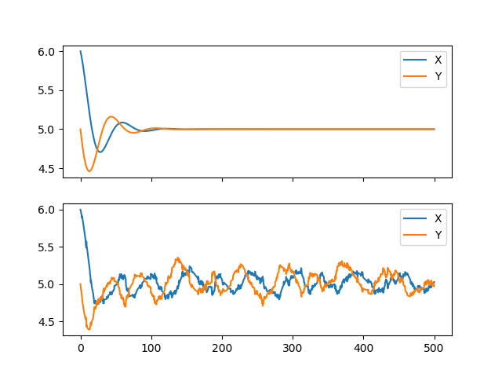

# Gene Regulatory Networks

The expression of useful gene products is central to the cell's survival. Equally important is that these gene products are produced at the right time under the right conditions. The cell can therefore be taken as a computation machine which takes a variety of environmental signals and produces an output of gene expression in response. These computations are carried out, in part, by gene regulatory networks. In these, one gene's product might activate or repress the expression of another gene. The interactions beteween components can exhibit complicated dynamics with behaviours such as memory, oscillations and noise filtering. The time evolution of a given gene regulatory network can be examined with this program.

This is done by setting up a system of differential equations from the user inputted gene network and then solving it numerically by Euler's method.

## Gene Expression Model

The concentration of a gene's product `X` continously falls at a rate proportional to `X`. This constant of proportionality, `alpha`, is the sum of the rates of protein degradation and cell growth. 

To balance the fall in concentration protein is continously produced. This is controlled by the abundance of activating or repressing proteins. Genes can have operators, which are binding sites for a single ligand protein. The occupancy of a given operator by a ligand influences the rate of expression according to whether it is a repressor or an activator. The percentage occupation by a ligand is given by the Michaelis function:

%20%3D%20%5Cfrac%20%7BX%5En%7D%7BK%5En%2BX%5En%7D)

Where `K` is the threshold at which there is 0.5 occupation, `n` is a measure of the cooperativity of binding and `omega` is the system's state. For simplicity, `n` can sometimes be taken to tend to infinity and so `g` becomes 1 if `X > K` and 0 otherwise. Because binding to operators is independent, the fractional occupancy of a combination of operator binding states, `i`, is just the product of the occupancies of the operators. For example, for the operator state X bound, Y bound, Z not bound. The fractional occupancy would be:

%20%3D%20%5Cfrac%20%7BX%5E%7Bn_1%7D%7D%7BK_1%5E%7Bn_1%7D%2BX%5E%7Bn_1%7D%7D%20%5Cfrac%20%7BY%5E%7Bn_2%7D%7D%7BK_2%5E%7Bn_2%7D%2BY%5E%7Bn_2%7D%7D%20(1-%5Cfrac%20%7BZ%5E%7Bn_3%7D%7D%7BK_3%5E%7Bn_3%7D%2BZ%5E%7Bn_3%7D%7D))

For every possible combination of operator binding states, there is an associated rate of production, `beta`. The rate of change of a gene's protein is therefore:

)

For example, for a simple gene with one operator to which Y can bind and act as a repressor, the differential equation becomes:

)

Here if Y is bound, `beta` is 0 so that term need not be taken into account. It can be seen that as `Y` increases, the rate of change of `X` decreases, in line with the expected behaviour.

## Examples

Here are some of the behaviours that gene regulatory networks can exhibit and how they are implemented. `config.py` files and gene network files are found in [GeneNetworks](https://github.com/JBQuim/Gene-Regulatory-Networks/tree/master/GeneNetworks). For more gene network motifs and explanation of their design see Uri Alon's book "An Introduction to Systems Biology".

#### Incoherent feedforward Loop

In this network, X activates Y and Z but Y represses Z. Both are taken to be highly cooperative and so their activity can be approximated as step functions. X only functions when there is a signal, S, present. The result is a prolonged signal in S is converted into a pulse of Z. This is because X initially activates Z expression but eventually Y represses it, converting it into a pulse. If the signal is short, X does not build up and there is no response in Z. 
 


If Y is not a strong a repressor as before, instead of a pulse, Z settles into a steady state concentration. Crucially the response time, time taken to reach half steady state, is shorter here than if X had directly activated Z.
 


#### Coherent Feedforward Loop

If instead Y is an activator of Z, the fall of the concentration of Z is delayed when the signal is stopped. This means drops in signal can be filtered out.



#### SIM

A single input module (SIM) is a regulatory motif whereby a single gene activates many others. This is desirable in the cell to localize computation to a single gene which then activates others to change the cell's intracellular environment in response. Moreover, it would be preferable if the genes could be expressed in a temporally ordered manner. By making X activate Z1, Z2 and Z3 with increasing thresholds, a last in first out (LIFO) scheme is achieved.



If a first in first out (FIFO) scheme is preferred instead another gene regulated by X, Y, must be added. By having Y activate Z1, Z2 and Z3 with thresholds in the reverse order of activation by X, FIFO is achieved.



#### Positive feedback loop

A gene that activates itself can achieve two different steady states. If two signals Sx and Sy can activate or repress X expression further, then when the signal is stopped the system will settle to the steady state that is closest. This achieves a system with memory of the identity of the last pulse it received.



#### Oscillator

Having a loop of three repressors such that X represses Y, Y represses Z and Z represses X leads to an oscillator.



Damped oscillations are achieved if X represses Y and Y activates X. If some noise is added these oscillations no longer become damped.



## Usage

To use, two files must be configured. These are `config.py` and a `.txt` file that holds the particularity of the gene network. Sample files of both kinds can be found in [GeneNetworks](https://github.com/JBQuim/Gene-Regulatory-Networks/tree/master/GeneNetworks).

#### config.py

In `config.py` the simulation parameters must be specified within `setup()`. These include:

- `step` the size of the steps taken by the Euler differential equation solver. The smaller the more accurate, but the longer the calculation will take.
- `endTime` the time at which to end the simulation.
- `saveFile` the name and location of the `.png` file the output plot will be saved to. If set to `-1` it will not be saved. E.g. `saveFile = "GeneNetworks/Oscillator/OscillatorNoise.png"
- `plotInfo` is a list of lists. For every list inside `plotInfo`, a plot will be made with the species contained within the list. E.g. `plotInfo = [[0,1],[2],[3,0]]` will produce 3 plots sharing the x axis with the first having species 0 and 1, the second only species 2 and the third species 3 and 0.
- `speciesNames` is a list of the names of each species, in order.
- `concentrations` is an array of the initial conditions of the simulation.
- `species` is an array of gene objects. This can be generated by doing, for example, `species = loadNetwork("Oscillator/clockNoise")` which will load the gene network from `GeneNetworks/Oscillator/clockNoiose.txt`.

The `event(t, systemState)` function can also be modified. It is run every time step of the Euler differential equation solver and returns the `systemState`. It can be modified to produce changes in signal molecules or gene products. Here are two examples:

```
def event(t, systemState):
    rand = (random.random()-0.5)/10
    systemState[3] += rand
    systemState[2] -= rand
    return systemState
```

This adds a bit of noise to the concentration of species 2 and 3 every timestep.

```
def event(t, systemState):
    if t == 100:
         systemState[0] = 1
    elif t == 400:
         systemState[0] = 0
    elif t == 600:
         systemState[0] = 2
    return systemState
```

This changes the concentration of species 0 at different times.

#### Gene network files

These are json files that hold the structure of the whole gene network. It is a list, between square brackets and separated by commas, of individual genes. They are best made by taking an existing file and adding/changing genes as needed. Genes have the following attributes:

- `speciesName` - the name of the species
- `speciesId` - the number which identifies the species
- `alpha` - the constant of proportionality for degradation
- `operatorCount` - the amount of operators the gene has
- `operatorLigands` - the number associated with the species that binds to each operator. This is a list with length `operatorCount`.
- `thresholds` - a list of the threshold of every operator
- `logic` - a list of booleans indicating the shape of binding curve to every operator. If `false`, percentage occupancy is given by Michaelis-Menten model. If `true`, percentage occupancy is step-like and equivalent to the case of `n->infinity`.
- `hillsCoeff` - a list of the values of `n` for every operator. The length of the list must be `operatorCount` even if not all operators exhibit Michaelis mode of binding. The coefficient given will simply be ignored if `logic` for that operator is set to `true`.
- `operatorStates` - this is a list of all the desired ligand binding combinations. Every item in the list is another list, with every value being a boolean. For example, if X binds at operator 0 and Y at operator 1 and we want transcription when X or Y are bound this will be set to `operatorStates = [[True, True], [True, False], [False, True]]`. If instead transcription occurs only when neither is bound or X is bound but not Y it will be set to `operatorStates = [[False, False], [True, False]]`
- `betas` - this is a list of the value of beta for every combination in `operatorStates`. All non-specified combinations in `operatorStates` are taken to have beta of 0.

Setting up a gene network can be quite involved at the beginning. Taking a look at the examples to understand the process fully can be useful.

## Improvements

Gene regulatory networks are very visual constructs and so it is a shame that this is lost by abstraction into json files. In the future, adding a GUI would really benefit the usability. 

